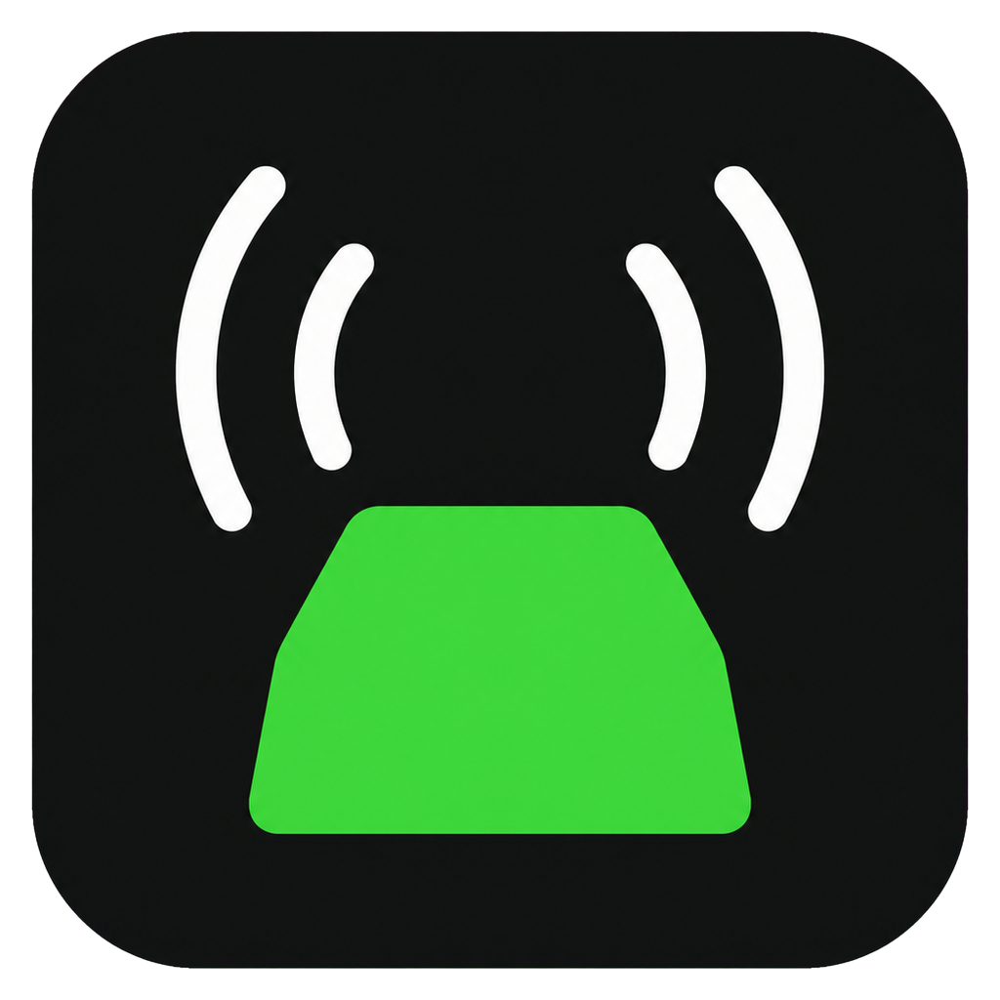
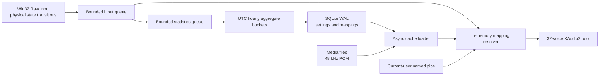

# KeyClick

<p align="center">
  
</p>

KeyClick is a native Windows 11 sound studio and private activity dashboard. Keyboard audio can play once on the first physical key-down or on key-up; pointer audio remains button-up and accumulated wheel-detent only. It is private by design: it never stores typed characters, typing order, event history, raw application paths in statistics, or UI content, and it never sends telemetry. The running app remains unelevated; only Setup requests UAC when writing application files to Program Files.

Windows v1 is implemented in C#, WPF, .NET 10 LTS, SQLite, Win32 Raw Input, and XAudio2. The repository reserves native application roots for future Linux and macOS versions while sharing input IDs, sound-pack manifests, integration schemas, and fixtures.

The current release is **1.6.2**, available as Setup and fully portable executables for Windows x64 and ARM64. Both editions are offline-first, preserve user data during verified updates, and contain the same sound packs, Pointer Studio, statistics, Fun Stats, typing challenges, themes, and privacy protections.

## Highlights

- Thirteen built-in packs with deterministic per-key sound identities: each physical key consistently uses its assigned category recording, including the Cloudflare Pay-inspired Cream Keys pack, two Pixabay-licensed mechanical packs, and ten original synthesized packs.
- A persistent Grid/List sound-pack browser, defaulting to Grid, that keeps page scrolling responsive while the pointer is over pack cards.
- New installations and settings resets default to **Cream Keys**; existing installations keep their selected pack.
- Base, Shift, AltGr, and lock enabled/disabled variants.
- Reversible per-pack overrides for individual keys, pointer buttons, wheels, and device families.
- Independent master, category, and input volumes with immediate preview and debounced persistence; new installs and settings resets start at 30% master volume.
- WAV, MP3, and OGG importing with decoded-content validation, five-second/20 MB limits, 48 kHz PCM normalization, and SHA-256 deduplication.
- Configurable first-key-down/key-up keyboard audio with typematic suppression; pointer movement never plays sounds.
- Separate trackpad/external-mouse identities when Windows drivers expose them reliably.
- App-level/global chords and two-step sequences that never suppress foreground input, presented as readable **shortcut → action** rows with scope and type details.
- Opt-in, allow-listed, current-user named-pipe API for semantic outcome cues.
- Button-based Light, Dark, and live System themes; theme-aware dialogs and inputs; accessible black text on primary buttons; a lower-brightness Dark-mode accent; tray lifecycle; startup support; app exclusions; backup; and manual-only updates.
- When **Minimize to system tray** is enabled, both Minimize and Close hide the window while KeyClick keeps running; only **Exit** from the tray stops it. With the setting disabled, Close exits normally.
- English and French UI with Windows display-language detection plus a persistent manual app-language override.
- Independent, default-on keyboard and pointer aggregate statistics with once-per-second live visible updates, recent-duration filters, speed metrics, comparisons, local CSV export, and category/range deletion. The full-width Statistics workspace is organized into compact Overview, Pointer, Keyboard, Applications, and Wellness views.
- Default-on, fully offline **Fun Stats** on Home, every overview metric card, and the Statistics dashboard. A versioned catalog of 50 English/French comparisons turns aggregate activity into milestones such as books, crowds, buildings, travel distances, celestial distances, time equivalents, and typing/clicking rates without fetching or transmitting data.
- A customizable six-to-twelve-tile Fun Stats dashboard with linear, route, radial, and equivalence visuals; stable fact rotation; category/fact controls; structured personal milestones; calibrated estimated scroll distance; profile transfer; and local milestone advancement.
- Social-ready Fun Stats images rendered locally at 1200×630 or 1200×1200 with a branded, balanced header, selected period, generation date, and optional localized caption. Clipboard sharing never includes application names, paths, typed content, or other private data.
- Reusable activity charts with Counts, Rates, and Active-time families; line, grouped-bar, and meaningful donut views; Auto/hourly/daily/weekly/monthly grouping; selectable series; comparison overlays; pointer-following tooltips; keyboard point navigation; and reduced-motion support.
- A dedicated offline **Pointer Studio** with a responsive, full-width visual grid for ten original cursor families. Each family includes a coordinated set of 15 common pointer roles—arrow, hand, text insertion, working, busy, precision, handwriting, unavailable, move, alternate select, and every standard resize direction—plus four sizes, automatic light/dark/high-contrast variants, favorites, tray quick switching, native Windows speed/precision/trails/shadow controls, and safe restore actions.
- Event-driven companion effects and click indicators for left, right, middle, and auxiliary buttons, with configurable rings, ripples, tiny explosions, sparkles, radial ticks, and pulses. Effects sleep after settling, adapt to battery/fullscreen/RDP/Reduced Motion, and remain disabled by default.
- Privacy-safe connected mouse/trackpad discovery, non-destructive per-device button actions, and guarded Experimental full replacement/global suppression with a visible failsafe cursor, recovery marker, tray panic action, and `Ctrl+Alt+Shift+F12` panic shortcut.
- Responsive click-indicator cards fill the available Pointer Studio width while keeping each channel's master switch, style, color, and size controls visibly grouped. Larger 40–44 px interaction targets, familiar switch controls, explicit dependent-control states, labeled Fun Stats columns, restrained tooltips, and visually distinct destructive actions improve scanability and reduce accidental changes in both Light and Dark themes.
- Long-running imports, exports, restores, resets, updates, Pointer Studio operations, and device discovery remain responsive, prevent accidental duplicate activation, and report progress or localized failures. Startup loads independent packs and shortcuts concurrently, while Statistics coalesces event-driven refreshes and performs no idle polling when unchanged.
- Hardened local boundaries validate imported custom-sound IDs and profile collection sizes, exclude cursor recovery state from backups, neutralize spreadsheet formulas in CSV fields, bound extreme wheel reports, require the suppression panic hotkey before activation, and reverify locked update files immediately before launch.
- Version 1.6.2 also honors filename-only application exclusions, prevents stale foreground-app resolution from replacing newer state, removes legacy content-derived custom-prompt identifiers through an automatic local migration, keeps prompt deletion from creating a recoverable plaintext copy, confines backup restoration and user-data cleanup to an unelevated process, and hardens release automation with immutable dependencies and least-privilege jobs.
- A Home and Statistics physical-key heatmap with click-open key details. Key popovers remain open until dismissed, stay within the KeyClick window, follow their selected key while content scrolls, and close when KeyClick loses focus.
- Privacy-minimized per-application totals displayed as easy-to-scan application cards with friendly names such as Brave, Chrome, and VLC, followed by executable and aggregate activity details.
- Private offline Typing Challenges with an app-themed first-use disclosure, original English/French passages, custom prompts, free writing, timed/untimed and strict/flow modes, complete whitespace/Unicode input handling, visual results, normal-typing comparisons, personal bests, and two local streak types.
- Optional local wellness goals and 60/10 break reminders, automatic random pack rotation, and password-protected `.keyclickprofile` transfer.

## Architecture



The Raw Input callback performs no database access, decoding, process discovery, key-name creation, or history writes. A single background consumer flushes dirty aggregate buckets every 60 seconds, at hour rollover, when capture is disabled, and on clean shutdown. While Home or Statistics is visible, read-only in-memory snapshots update at most once per second without forcing database writes.

## Private local statistics

The one-time disclosure appears before collection begins, with keyboard and pointer statistics preselected; existing installations receive the revised disclosure once before per-application grouping begins. These controls remain independent from sound playback and from each other. KeyClick stores UTC hourly counts keyed by physical scan code/button, pointer family, and input group, plus compact active-time and peak-rate summaries. A separate application breakdown stores only total keyboard/pointer/scrolling counts under a source-salted app ID and executable filename; it never stores the raw path or app-specific per-key counts. Labels are resolved only for display.

Aggregate statistics remain local forever until the user deletes a selected period/category or all data. Settings reset does not delete statistics. Keyboard, mouse, and per-application statistics are never transmitted over the internet, included in update requests, exposed through the named pipe, or attached to logs. Per-application details are excluded from CSV and `.keyclickprofile` exports. KeyClick never stores typed characters or reconstructable ordered input.

## Fun Stats and activity visualizations

Fun Stats are derived entirely from the same local aggregate counters used by the Statistics workspace. New and upgraded installations enable the dashboard and metric-card facts by default with six curated tiles; users can disable the feature, select and reorder up to twelve tiles, filter fact categories, choose a rotation cadence, and add validated custom milestones without formulas or executable content. Estimated scroll distance defaults to 1.27 cm per wheel detent and can be entered directly or calibrated in a local test surface.

The immutable catalog and schema live under `shared/`, include dated source/year notes, and mark estimates with `≈`. Built-in milestones advance to the next meaningful target after completion, while custom milestones remain complete at 100%. All catalog facts, formatting, customization, and sharing work without network access.

Activity charts re-aggregate the existing hourly trend data in the presentation layer, so selecting different metrics, views, grouping, comparisons, or series does not add database queries per tile or change the Raw Input path. Chart tooltips show bucket ranges and enabled values, remain clamped inside the chart, and have keyboard-accessible summaries and navigation.

## Pointer Studio

Pointer Studio is a top-level workspace organized into Designs, Motion & Clicks, Devices & Buttons, and Performance & Safety. Its versioned catalog and original cursor provenance are bundled under `shared/`; cursor assets are compiled deterministically on the device and never downloaded. A design can be applied system-wide, inside KeyClick only, or as a temporary preview. Before the first system change, KeyClick snapshots the current per-user Windows cursor and pointer settings so the entire scheme can be restored after a failure, interrupted Experimental session, or uninstall.

Actual pointer behavior remains separate from visual effects. Windows speed, Enhance Pointer Precision, native trails, and native shadow use the supported per-user controls. Companion effects use an event-driven, click-through compositor and keep the precise system cursor visible. They render only while an animation is active, are capped at 60 FPS (30 FPS on battery), and stop after settling. Experimental replacement and suppression never reactivate from an imported profile; suppression is global by button because Windows hooks cannot safely identify a physical source device, while ordinary per-device mappings always preserve the original click.

## Private typing challenges

Typing Challenges run entirely inside the native app. The response is held only
in memory while the challenge is active and is discarded when the run ends;
challenge responses are never stored. When result saving is enabled, KeyClick
stores only aggregate session metrics and five-second elapsed-time samples. A
custom source prompt is stored only after the user explicitly selects **Save
locally** and confirms the warning.

Challenge typing is excluded from normal Keyboard Statistics and keyboard
wellness goals by default, keeping the everyday baseline independent. Users may
opt in without changing sound behavior. Aggregate challenge history can be
deleted by result or period and exported to a local CSV without response or
prompt content. Saved prompts can be included only in a password-protected,
locally created profile. Challenge data is never transmitted or made available
to the updater, named pipe, telemetry, or any background service.

## Repository layout

```text
apps/windows/          Windows WPF app, native services, bootstrap, and tests
apps/linux/            Reserved for a future native Linux app
apps/macos/            Reserved for a future native macOS app
shared/specs/          Platform-neutral pack and integration contracts
shared/fixtures/       Cross-platform compatibility fixtures
scripts/               Local and CI build tooling
```

Bundled third-party audio sources and license notes are recorded in [THIRD-PARTY-NOTICES.md](THIRD-PARTY-NOTICES.md).

## Build

Requirements: Windows 11, the .NET 10.0.302 SDK, and Windows SDK 10.0.26100 or newer.

```powershell
dotnet restore KeyClick.sln
dotnet build KeyClick.sln -c Release
dotnet test KeyClick.sln -c Release
```

Create setup and portable executables for both architectures:

```powershell
./scripts/Build-Portable.ps1 -Version 1.6.2
```

The script writes these canonical, versioned artifacts plus SHA-256 checksums directly under `artifacts/`:

- `KeyClick-Portable-Windows-x64-1.6.2.exe`
- `KeyClick-Portable-Windows-arm64-1.6.2.exe`
- `KeyClick-Setup-Windows-x64-1.6.2.exe`
- `KeyClick-Setup-Windows-arm64-1.6.2.exe`
- `checksums-1.6.2.txt`

`KeyClick-Setup-Windows-<architecture>-<version>.exe` is the installable edition. Setup requests UAC only for installation, places the stable `KeyClick.exe` launcher and versioned application files under `%ProgramFiles%\KeyClick`, creates shortcuts, and registers HKCU uninstall metadata. The app itself stays unelevated and keeps SQLite data/statistics, media, settings, logs, updates, and backups under `%LOCALAPPDATA%\KeyClick`, preserving them during upgrades. Backup restoration and optional uninstall cleanup of that user-writable data also run unelevated. Database schema migrations are transactional, local, and automatic at first launch; 1.6.2 adds migration 6, which clears obsolete identifiers derived from unsaved custom prompt content while retaining IDs for explicitly saved prompts. There is no server or separate production database to migrate. `KeyClick-Portable-Windows-<architecture>-<version>.exe` is the portable edition. It creates no shortcuts or registry entries and keeps code, SQLite data/statistics, media, logs, and backups under `KeyClickData` beside the launcher. If that directory is not writable, the user can explicitly use the installed AppData store or exit. No legacy duplicate executables are produced. Packaging follows SemVer and retains only the current and immediately preceding artifact versions.

Updates are strictly manual: GitHub is contacted only after **Check for updates** is pressed. Production builds do not inspect environment variables or local developer artifact folders at startup. Installed builds select setup assets; portable builds select portable assets and save the verified newer launcher beside the current copy. Applying either kind of update creates a safety backup, verifies the staged bytes again while preventing replacement, and preserves the separate statistics, custom packs, settings, mappings, and configuration data store.

## Custom sound packs

Choose **Sound Packs → Import sound pack…** to import a `.keyclickpack` or `.zip` archive. The archive must contain `pack.json` at its root and may contain WAV, MP3, or OGG clips up to five seconds each. Imports are validated, normalized to KeyClick’s 48 kHz mono PCM format, deduplicated by SHA-256, and stored locally.

```json
{
  "version": 1,
  "id": "my-soft-pack",
  "name": "My Soft Pack",
  "family": "Personal",
  "description": "Quiet sounds for focused work.",
  "accent": "#7BE88B",
  "groups": {
    "letters": { "base": ["audio/key-1.wav", "audio/key-2.wav"] },
    "enter": { "base": ["audio/enter.wav"] },
    "pointerPrimary": { "base": ["audio/click.wav"] }
  }
}
```

Group names and variants follow [the v1 sound-pack schema](shared/specs/sound-pack.schema.json). A missing variant falls back to that group’s `base` pool; a missing group falls back to the first available pool so partial packs remain usable.

## Local data and privacy

Settings, mappings, aggregate statistics, and achievements live in the selected local `data\keyclick.db`; custom media remains local under `media`. No keystroke, text, input-order, raw statistic-path, or per-event timestamp table exists. Network access is disabled by default. The only network path is the isolated manual updater, created lazily after the user presses **Check for updates**; it permits HTTPS GETs to fixed GitHub release hosts and verifies SHA-256 before replacement. There are no automatic checks or background pings.

## Portable profiles

Versioned `.keyclickprofile` files can preview and merge selected transferable settings/mappings, custom packs/audio, aggregate statistics, wellness achievements, and optional challenge history. Saved challenge prompts are default-off and require password protection. Machine-specific startup, audio-device, exclusion, integration, data-root, update, and device-path state is always omitted. Statistics and challenge history merge idempotently. Optional protection uses AES-256-GCM with PBKDF2-HMAC-SHA256. Profiles are local files only and are never uploaded by KeyClick.

## Platform status

- Windows 11 x64/ARM64: current release 1.6.2.
- Linux: contracts reserved; native application deferred.
- macOS: contracts reserved; native application deferred.

## Contributing and release rules

Contributions are welcome, but KeyClick's input-path performance and local-only privacy boundary are non-negotiable:

- Keep the Raw Input callback bounded and non-blocking. Do not add media decoding, SQLite access, display-name resolution, logging, dispatcher work, or network access to it.
- Never persist or log typed content, input order, per-event timestamps, UI content, raw application paths in statistics, application-specific physical-key data, or challenge responses.
- Never transmit keyboard, mouse, per-application, challenge, wellness, profile, or prompt data. Networking must remain isolated to lazy, user-triggered HTTPS GET update operations in `KeyClick.Updater`; automatic checks, telemetry, pings, advertisements, and cloud sync are prohibited.
- Keep built-in packs immutable and customizations reversible. Validate imported archives, paths, sizes, hashes, and decoded audio before local use.
- Add every user-facing string in both English and French, and verify Light, Dark, and System themes at the minimum supported window size.
- Add or update tests, then run `dotnet build KeyClick.sln -c Release`, `dotnet test KeyClick.sln -c Release`, and `./scripts/Test-PrivacyBoundary.ps1` before opening a pull request.
- Follow Semantic Versioning. Release artifacts must include the version, cover x64/ARM64 Setup and Portable editions, and have a matching SHA-256 manifest. Published versions are never rewritten.
- Privacy-critical changes require `@askasjeremy` CODEOWNERS approval. Pull requests that weaken the Privacy Boundary, expose updater payload APIs, add automatic networking, or allow statistics/challenge transmission must be rejected.

See [CONTRIBUTING.md](CONTRIBUTING.md) for the complete workflow, [PRIVACY.md](PRIVACY.md) for the data boundary, and [SECURITY.md](SECURITY.md) for private vulnerability reporting. KeyClick is licensed under the [MIT License](LICENSE).
