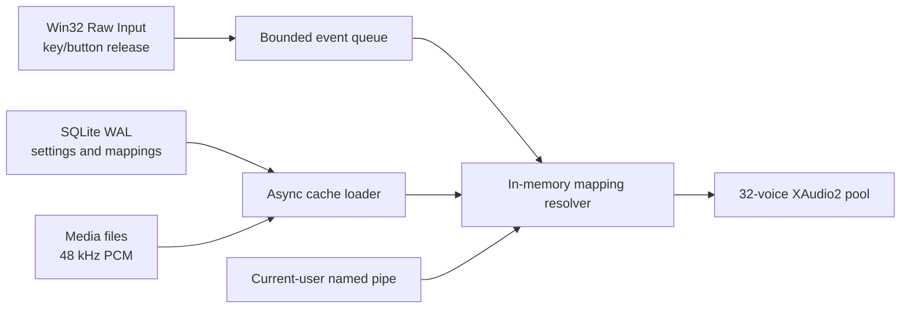

# KeyClick

KeyClick is a native Windows 11 sound studio that plays short, customizable sounds at the exact key-up, pointer-button-up, and accumulated wheel-detent actions. It is private by design: it does not store typed characters or input history, inspect application content, send telemetry, or require elevation.

Windows v1 is implemented in C#, WPF, .NET 10 LTS, SQLite, Win32 Raw Input, and XAudio2. The repository reserves native application roots for future Linux and macOS versions while sharing input IDs, sound-pack manifests, integration schemas, and fixtures.

## Highlights

- Ten original, procedurally generated sound packs with no immediate sample repetition.
- Base, Shift, AltGr, and lock enabled/disabled variants.
- Reversible per-pack overrides for individual keys, pointer buttons, wheels, and device families.
- Independent master, category, and input volumes with immediate preview and debounced persistence.
- WAV, MP3, and OGG importing with decoded-content validation, five-second/20 MB limits, 48 kHz PCM normalization, and SHA-256 deduplication.
- Background Raw Input capture on release only; movement and key-down/repeat events never play sounds.
- Separate trackpad/external-mouse identities when Windows drivers expose them reliably.
- App-level/global chords and two-step sequences that never suppress foreground input.
- Opt-in, allow-listed, current-user named-pipe API for semantic outcome cues.
- Light, Dark, and live System themes; tray lifecycle; startup support; app exclusions; backup; and manual-only updates.
- English and French UI with Windows display-language detection plus a persistent manual app-language override.

## Architecture



The Raw Input callback performs no database access, decoding, key-name creation, or history writes. Active pack data is decoded before use and swapped into the audio cache away from the input path.

## Repository layout

```text
apps/windows/          Windows WPF app, native services, bootstrap, and tests
apps/linux/            Reserved for a future native Linux app
apps/macos/            Reserved for a future native macOS app
shared/specs/          Platform-neutral pack and integration contracts
shared/fixtures/       Cross-platform compatibility fixtures
scripts/               Local and CI build tooling
```

## Build

Requirements: Windows 11, the .NET 10.0.302 SDK, and Windows SDK 10.0.26100 or newer.

```powershell
dotnet restore KeyClick.sln
dotnet build KeyClick.sln -c Release
dotnet test KeyClick.sln -c Release
```

Create both portable launchers:

```powershell
./scripts/Build-Portable.ps1 -Version 1.0.0
```

The script writes `KeyClick-Windows-x64.exe`, `KeyClick-Windows-arm64.exe`, and SHA-256 checksums under `artifacts/portable`. Each download is a single self-contained bootstrap executable; installed code is extracted to `%LOCALAPPDATA%\KeyClick\app-v<version>`, while data, media, logs, and backups remain outside versioned code.

## Local data and privacy

Settings and mappings live in `%LOCALAPPDATA%\KeyClick\data\keyclick.db`. Imported normalized audio lives in `%LOCALAPPDATA%\KeyClick\media\sounds`. No keystroke or text history table exists. Network access occurs only after the user chooses **Check for updates**.

## Platform status

- Windows 11 x64/ARM64: v1 implementation.
- Linux: contracts reserved; native application deferred.
- macOS: contracts reserved; native application deferred.

## Contributing and security

See [CONTRIBUTING.md](CONTRIBUTING.md) for development checks and [SECURITY.md](SECURITY.md) for private vulnerability reporting. KeyClick is licensed under the [MIT License](LICENSE).
