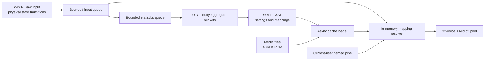

# KeyClick

<p align="center">
  
</p>

KeyClick is a native Windows 11 sound studio and private activity dashboard. Keyboard audio can play once on the first physical key-down or on key-up; pointer audio remains button-up and accumulated wheel-detent only. It is private by design: it never stores typed characters, typing order, event history, foreground-app activity, or UI content, and it never sends telemetry or requires elevation.

Windows v1 is implemented in C#, WPF, .NET 10 LTS, SQLite, Win32 Raw Input, and XAudio2. The repository reserves native application roots for future Linux and macOS versions while sharing input IDs, sound-pack manifests, integration schemas, and fixtures.

## Highlights

- Thirteen built-in packs with deterministic per-key sound identities: each physical key consistently uses its assigned category recording, including the Cloudflare Pay-inspired Cream Keys pack, two Pixabay-licensed mechanical packs, and ten original synthesized packs.
- New installations and settings resets default to **Cream Keys**; existing installations keep their selected pack.
- Base, Shift, AltGr, and lock enabled/disabled variants.
- Reversible per-pack overrides for individual keys, pointer buttons, wheels, and device families.
- Independent master, category, and input volumes with immediate preview and debounced persistence; new installs and settings resets start at 35% master volume.
- WAV, MP3, and OGG importing with decoded-content validation, five-second/20 MB limits, 48 kHz PCM normalization, and SHA-256 deduplication.
- Configurable first-key-down/key-up keyboard audio with typematic suppression; pointer movement never plays sounds.
- Separate trackpad/external-mouse identities when Windows drivers expose them reliably.
- App-level/global chords and two-step sequences that never suppress foreground input.
- Opt-in, allow-listed, current-user named-pipe API for semantic outcome cues.
- Light, Dark, and live System themes; tray lifecycle; startup support; app exclusions; backup; and manual-only updates.
- Closing the KeyClick window or choosing **Exit** from the tray fully stops audio and input capture. Minimizing can keep the still-running app in the tray when that setting is enabled.
- English and French UI with Windows display-language detection plus a persistent manual app-language override.
- Independent, default-on keyboard and pointer aggregate statistics with native charts, a Home and Statistics physical-key heatmap with click-open key details, speed metrics, comparisons, local CSV export, and category/range deletion.
- Optional local wellness goals and 60/10 break reminders, automatic random pack rotation, and password-protected `.keyclickprofile` transfer.

## Architecture



The Raw Input callback performs no database access, decoding, process discovery, key-name creation, or history writes. A single background consumer flushes dirty aggregate buckets every 60 seconds, at hour rollover, when capture is disabled, and on clean shutdown. Statistics are queried only when the Statistics page or an export needs them.

## Private local statistics

The one-time disclosure appears before collection begins, with keyboard and pointer statistics preselected. These controls remain independent from sound playback and from each other. KeyClick stores only UTC hourly counts keyed by physical scan code/button, pointer family, and input group, plus compact active-time and peak-rate summaries. Labels are resolved only for display.

Aggregate statistics remain local forever until the user deletes a selected period/category or all data. Settings reset does not delete statistics. Keyboard and mouse statistics are never transmitted over the internet, included in update requests, exposed through the named pipe, or attached to logs. KeyClick never stores typed characters or reconstructable ordered input.

## Repository layout

```text
apps/windows/          Windows WPF app, native services, bootstrap, and tests
apps/linux/            Reserved for a future native Linux app
apps/macos/            Reserved for a future native macOS app
shared/specs/          Platform-neutral pack and integration contracts
shared/fixtures/       Cross-platform compatibility fixtures
scripts/               Local and CI build tooling
```

Bundled third-party audio sources and license notes are recorded in [THIRD-PARTY-NOTICES.md](THIRD-PARTY-NOTICES.md).

## Build

Requirements: Windows 11, the .NET 10.0.302 SDK, and Windows SDK 10.0.26100 or newer.

```powershell
dotnet restore KeyClick.sln
dotnet build KeyClick.sln -c Release
dotnet test KeyClick.sln -c Release
```

Create setup and portable executables for both architectures:

```powershell
./scripts/Build-Portable.ps1 -Version 1.1.2
```

The script writes these canonical, versioned artifacts plus SHA-256 checksums directly under `artifacts/`:

- `KeyClick-Portable-Windows-x64-1.1.2.exe`
- `KeyClick-Portable-Windows-arm64-1.1.2.exe`
- `KeyClick-Setup-Windows-x64-1.1.2.exe`
- `KeyClick-Setup-Windows-arm64-1.1.2.exe`
- `checksums-1.1.2.txt`

`KeyClick-Setup-Windows-<architecture>-<version>.exe` is the installable edition. Setup is per-user and non-elevated, installs versioned code under `%LOCALAPPDATA%\KeyClick`, creates shortcuts, and registers HKCU uninstall metadata while preserving user data during upgrades. `KeyClick-Portable-Windows-<architecture>-<version>.exe` is the portable edition. It creates no shortcuts or registry entries and keeps code, SQLite data/statistics, media, logs, and backups under `KeyClickData` beside the launcher. If that directory is not writable, the user can explicitly use the installed AppData store or exit. No legacy duplicate executables are produced. Packaging follows SemVer and retains only the current and immediately preceding artifact versions.

Installed builds can discover the newest compatible, checksum-verified setup in the local `artifacts/` release folder and expose an **Update** action in About & Updates. GitHub remains manual-only: it is contacted only after **Check for updates** is pressed. Installed builds select setup assets; portable builds select portable assets and save the verified newer launcher beside the current copy. Applying either kind of update creates a safety backup and preserves the separate statistics, custom packs, settings, mappings, and configuration data store.

## Custom sound packs

Choose **Sound Packs → Import sound pack…** to import a `.keyclickpack` or `.zip` archive. The archive must contain `pack.json` at its root and may contain WAV, MP3, or OGG clips up to five seconds each. Imports are validated, normalized to KeyClick’s 48 kHz mono PCM format, deduplicated by SHA-256, and stored locally.

```json
{
  "version": 1,
  "id": "my-soft-pack",
  "name": "My Soft Pack",
  "family": "Personal",
  "description": "Quiet sounds for focused work.",
  "accent": "#7BE88B",
  "groups": {
    "letters": { "base": ["audio/key-1.wav", "audio/key-2.wav"] },
    "enter": { "base": ["audio/enter.wav"] },
    "pointerPrimary": { "base": ["audio/click.wav"] }
  }
}
```

Group names and variants follow [the v1 sound-pack schema](shared/specs/sound-pack.schema.json). A missing variant falls back to that group’s `base` pool; a missing group falls back to the first available pool so partial packs remain usable.

## Local data and privacy

Settings, mappings, aggregate statistics, and achievements live in the selected local `data\keyclick.db`; custom media remains local under `media`. No keystroke, text, input-order, foreground-application, or per-event timestamp table exists. Network access is disabled by default. The only network path is the isolated manual updater, created lazily after the user presses **Check for updates**; it permits HTTPS GETs to fixed GitHub release hosts and verifies SHA-256 before replacement. There are no automatic checks or background pings.

## Portable profiles

Local `.keyclickprofile` files can preview and merge selected transferable settings/mappings, custom packs/audio, aggregate statistics, and wellness achievements. Machine-specific startup, audio-device, exclusion, integration, data-root, update, and device-path state is always omitted. Statistics merge idempotently by source, bucket, and revision. Optional protection uses AES-256-GCM with PBKDF2-HMAC-SHA256. Profiles are local files only and are never uploaded by KeyClick.

## Platform status

- Windows 11 x64/ARM64: v1 implementation.
- Linux: contracts reserved; native application deferred.
- macOS: contracts reserved; native application deferred.

## Contributing and security

See [CONTRIBUTING.md](CONTRIBUTING.md) for development checks and [SECURITY.md](SECURITY.md) for private vulnerability reporting. KeyClick is licensed under the [MIT License](LICENSE).
